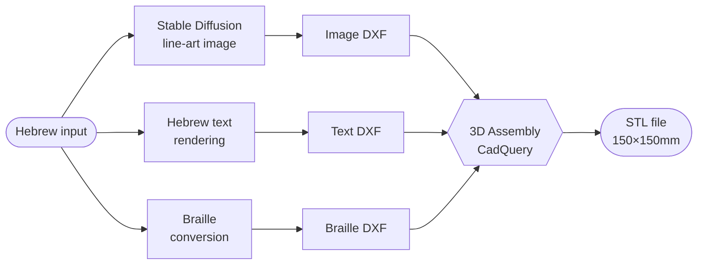
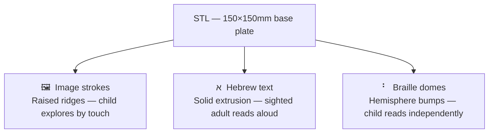

# TOM — Tactile Hebrew Storybook Generator

## The Mission

Young blind children lack illustrated storybooks. While sighted toddlers enjoy picture books, blind children are left with text only, missing out on visual storytelling. This project was initiated with the help of a lead educator at **Eliya** (an organization supporting blind children in Israel) to close that gap.

**TOM** converts any storybook text into a **3D-printable tactile page**. Each page includes:
- A simplified line-art image the child can feel by touch
- The Hebrew word in raised text (for sighted adults reading alongside)
- The Braille transliteration for the child to read independently

The output is a ready-to-print STL file with distinct tactile height layers.

---

## How it works

For each page, the pipeline runs four stages:



The STL has three tactile layers:



### Two STL engines

TOM ships **two interchangeable ways** to turn the page layers into an STL:

| Engine | Module | Approach | Used by |
|---|---|---|---|
| **CadQuery / DXF** | `src/dxf_3d.py` | 3 DXFs → true 3D solids via CadQuery + pyclipper: extruded text, hemisphere Braille domes, dome-profile image ridges, optional hatch texture. Precise geometry, heavier deps. | `hf_space/gradio_app.py`, CLI, FlowManager |
| **Lithophane / heightmap** | `src/lithophane.py` | Flatten all three layers into one grayscale heightmap (brightness → Z), mesh directly to a watertight STL. CadQuery-free, simpler, faster. | `hf_space/gradio_app_lithophane.py` (**deployed**) |

The deployed Space runs the **lithophane** variant; the **CadQuery** path is the canonical solid-modeling engine used from the CLI and notebooks.

---

## Deployment

### Backend — Hugging Face Spaces

The backend runs on **Hugging Face Spaces** (GPU via ZeroGPU). The Space is its own git repo, included here as the **`hf_space/` submodule**. `hf_space/gradio_app_lithophane.py` is the deployed entry point (lithophane variant with the public API); it is self-contained (bundles its own `src/`, `config.yaml`, `requirements.txt`).

> **Editing the Space:** edit inside `hf_space/`, then `git commit` + `git push` from that folder — HF auto-rebuilds on push. The repo-root `src/` is kept for the notebooks and CLI/FlowManager; run `./sync_to_space.sh` to mirror changes into `hf_space/`.

### Frontend — React web app

A public-facing Hebrew website lives in `web/` — React 19 + Vite + Tailwind v4, deployed to **Vercel**. Parents and teachers use it; no technical background assumed.

```bash
cd web && npm install && npm run dev   # http://localhost:5173
```

Set `VITE_HF_SPACE` to the HF Space id before running (see `web/.env.example`). The frontend talks exclusively to the `/generate_page` endpoint on the HF Space.

#### `/generate_page` API contract

| | |
|---|---|
| **Inputs** | `raw_text` (Hebrew), `variations` (nikud choices JSON), `image_desc`, `object_class` |
| **Outputs** | `image` (PNG file URL), `stl` (STL file URL) |

Deploy frontend: connect `web/` to a Vercel project, set env var `VITE_HF_SPACE`, auto-deploys on `git push`.

---

## Project Structure

```
book_generator_tom/
├── src/                      # Library modules — used by the notebooks & CLI/FlowManager
│   ├── language_funcs.py     # Hebrew ↔ Braille, translation, nikud disambiguation
│   ├── image_funcs.py        # Image processing, PNG → DXF, font setup
│   ├── image_generator.py    # Stable Diffusion pipeline wrapper
│   ├── dxf_3d.py             # STL engine 1 — 3 DXF files → solid STL (CadQuery + pyclipper)
│   ├── lithophane.py         # STL engine 2 — layers → heightmap → mesh STL (CadQuery-free, deployed)
│   ├── flow_manager.py       # Multi-page book orchestrator (CLI use)
│   └── config.py             # Loads config.yaml and exposes `cfg` dict
├── web/                      # React frontend (React 19 + Vite + Tailwind v4) → Vercel
│   ├── src/
│   │   ├── App.jsx           # 4-step flow: Landing → BookBuilder → Generate → Download
│   │   ├── api/hfClient.js   # Gradio client → /generate_page endpoint
│   │   ├── components/       # Stepper, NikudChooser, StlViewer, GenerateStep, …
│   │   ├── lib/copy.js       # All Hebrew UI strings (no jargon)
│   │   └── lib/nikud.js      # Nikud choices — must mirror SPECIAL_REPLACEMENTS in src/
│   └── CLAUDE.md             # Frontend-specific conventions (RTL, API contract, glossary)
├── hf_space/                 # Hugging Face Space (git submodule) — the deployed backend
│   ├── gradio_app_lithophane.py   # Deployed entry point (lithophane + /generate_page API)
│   ├── gradio_app.py         # Alternate variant (non-lithophane)
│   ├── src/                  # Self-contained snapshot of src/ for deployment
│   ├── config.yaml           # Self-contained snapshot of config.yaml
│   └── requirements.txt      # App deps (includes `spaces` for ZeroGPU)
├── notebooks/
│   └── text2stl_generator.ipynb   # Step-by-step dev/research notebook (one page)
├── .claude/                  # Claude Code tooling: skills/ (slash commands) + instructions/
├── config.yaml               # All geometry, SD, and DXF constants (edit here, not in code)
├── requirements.txt
└── pyproject.toml
```

---

## Running locally

The app lives in the `hf_space/` submodule and is self-contained:

```bash
pip install -r hf_space/requirements.txt
cd hf_space
python gradio_app.py
```

Open the Gradio URL in your browser:
1. Enter a book title
2. Add pages: paste Hebrew text, describe the image, name the object class
3. Click **Generate** — downloads a ZIP with DXFs, PNGs, and STL files

The Braille font downloads automatically on first run.

---

## CLI usage

### Convert three DXFs to a single STL

```bash
python src/dxf_3d.py --text text.dxf --braille braille.dxf --image image.dxf -o page1.stl
```

### Programmatic multi-page book (FlowManager)

```python
from src.flow_manager import FlowManager

pages = [
    {
        "page_number": 1,
        "image_description": "תפוח",
        "image_classification": "פרי",
        "generate_picture": True,
        "done": False,
    }
]

fm = FlowManager(book_name="my_book", pages=pages)
result = fm.run()
```

---

## Tuning output geometry

All physical dimensions live in `config.yaml` — edit there without touching any code:

```yaml
plate:
  width_mm: 150.0          # base plate size
  height_mm: 150.0
image_strokes:
  width_mm: 1.0            # raised ridge thickness
  height_mm: 1.5           # raised ridge height
braille:
  dome_height_ratio: 0.5   # dome height = radius × ratio
stable_diffusion:
  inference_steps: 25
  guidance_scale: 8.5
```

---

## Dependencies

| Package | Purpose |
|---|---|
| `torch` + `diffusers` | Stable Diffusion image generation (`segmind/SSD-1B`) |
| `opencv-contrib-python` | Image processing, skeletonization (`cv2.ximgproc.thinning`) |
| `ezdxf` | DXF read/write |
| `cadquery` | 3D solid modeling → STL export |
| `pyclipper` | Polygon offsetting for image stroke generation |
| `gradio` | Web UI |
| `deep-translator` | Hebrew → English translation |
| `matplotlib` | Rendering Hebrew text and Braille to images |
| `Pillow` | Image utilities |
| `pyyaml` | Config file loading |

> Use `opencv-contrib-python`, **not** `opencv-python` — the contrib build includes `cv2.ximgproc.thinning` (Zhang-Suen skeletonization). Without it the code falls back to Canny edges, producing double lines in the DXF.
