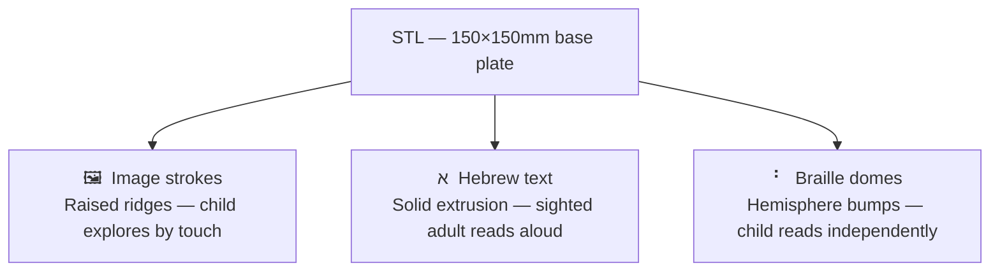

# TOM — Tactile Hebrew Storybook Generator

## The Mission

Young blind children lack illustrated storybooks. While sighted toddlers enjoy picture books, blind children are left with text only, missing out on visual storytelling. This project was initiated with the help of a lead educator at **Eliya** (an organization supporting blind children in Israel) to close that gap.

**TOM** converts any storybook text into a **3D-printable tactile page**. Each page includes:
- A simplified line-art image the child can feel by touch
- The Hebrew word in raised text (for sighted adults reading alongside)
- The Braille transliteration for the child to read independently

The output is a ready-to-print STL file with distinct tactile height layers.

---

## How it works

For each page, the pipeline runs four stages:


The STL has three tactile layers:



---

## Deployment

The backend is deployed on **Hugging Face Spaces** (GPU-accelerated). `app/app.py` is the Gradio web app that runs there. A dedicated frontend is planned.

> **HF Spaces note:** Spaces expects `app.py` at the repo root. Copy or symlink `app/app.py` to the root, or set the Space entry point in the Space settings.

---

## Project Structure

```
book_generator_tom/
├── src/                      # Reusable library modules
│   ├── language_funcs.py     # Hebrew ↔ Braille, translation, nikud disambiguation
│   ├── image_funcs.py        # Image processing, PNG → DXF, font setup
│   ├── image_generator.py    # Stable Diffusion pipeline wrapper
│   ├── dxf_3d.py             # 3 DXF files → single STL (CadQuery + pyclipper)
│   ├── flow_manager.py       # Multi-page book orchestrator (CLI use)
│   └── config.py             # Loads config.yaml and exposes `cfg` dict
├── app/
│   └── app.py                # Gradio web app — primary entry point
├── notebooks/
│   └── text2stl_generator.ipynb   # Step-by-step dev/research notebook (one page)
├── config.yaml               # All geometry, SD, and DXF constants (edit here, not in code)
├── requirements.txt
└── pyproject.toml
```

---

## Running locally

```bash
pip install -r requirements.txt
python app/app.py
```

Open the Gradio URL in your browser:
1. Enter a book title
2. Add pages: paste Hebrew text, describe the image, name the object class
3. Click **Generate** — downloads a ZIP with DXFs, PNGs, and STL files

The Braille font downloads automatically on first run.

---

## CLI usage

### Convert three DXFs to a single STL

```bash
python src/dxf_3d.py --text text.dxf --braille braille.dxf --image image.dxf -o page1.stl
```

### Programmatic multi-page book (FlowManager)

```python
from src.flow_manager import FlowManager

pages = [
    {
        "page_number": 1,
        "image_description": "תפוח",
        "image_classification": "פרי",
        "generate_picture": True,
        "done": False,
    }
]

fm = FlowManager(book_name="my_book", pages=pages)
result = fm.run()
```

---

## Tuning output geometry

All physical dimensions live in `config.yaml` — edit there without touching any code:

```yaml
plate:
  width_mm: 150.0          # base plate size
  height_mm: 150.0
image_strokes:
  width_mm: 1.0            # raised ridge thickness
  height_mm: 1.5           # raised ridge height
braille:
  dome_height_ratio: 0.5   # dome height = radius × ratio
stable_diffusion:
  inference_steps: 25
  guidance_scale: 8.5
```

---

## Dependencies

| Package | Purpose |
|---|---|
| `torch` + `diffusers` | Stable Diffusion image generation (`segmind/SSD-1B`) |
| `opencv-contrib-python` | Image processing, skeletonization (`cv2.ximgproc.thinning`) |
| `ezdxf` | DXF read/write |
| `cadquery` | 3D solid modeling → STL export |
| `pyclipper` | Polygon offsetting for image stroke generation |
| `gradio` | Web UI |
| `deep-translator` | Hebrew → English translation |
| `matplotlib` | Rendering Hebrew text and Braille to images |
| `Pillow` | Image utilities |
| `pyyaml` | Config file loading |

> Use `opencv-contrib-python`, **not** `opencv-python` — the contrib build includes `cv2.ximgproc.thinning` (Zhang-Suen skeletonization). Without it the code falls back to Canny edges, producing double lines in the DXF.
